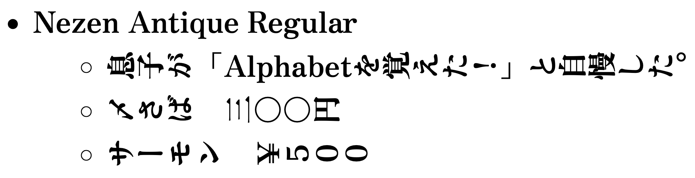

# 寝禅 / Nezen

[Zen Antique](hhttps://fonts.google.com/specimen/Zen+Antique)や[Zen Kaku Gothic Antique](https://fonts.google.com/specimen/Zen+Kaku+Gothic+Antique)などのフォントの和文字を90度回転させた「寝禅 / Nezen」を作りました。縦書きで文章を表現することが難しいシステムで縦書きを実現することを目的に作成されました。現在（v0.2）では個々の記号の回転や位置は調整していません。

横になって行う禅の寝禅が名前の由来です。

## ライセンス / LICENSE

- ソースコード：[MIT](LICENSE) © [Daiji256](https://github.com/Daiji256)
- フォント：[SIL OPEN FONT LICENSE Version 1.1](fonts/NezenAntique/OFL.txt)
