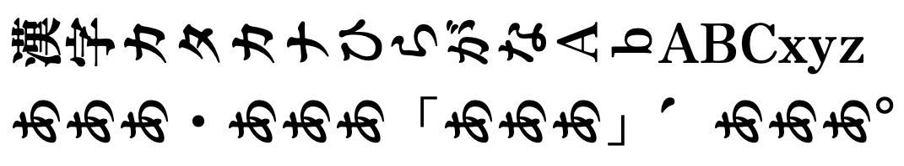

# 寝禅 / Nezen

[ZEN アンチック Soft](https://github.com/googlefonts/zen-antique) の和文字フォントを 90 度回転させた「寝禅」を作りました。寝禅は，縦書きで文章を表現することが難しいシステムでも，簡単に縦書きを実現するために作成されました。現在（v0.1）では個々の記号の回転向きの調整や，文字の位置調整は行なっていません。

「寝禅」というのは，禅を 90 度横に倒したことから，横になって行う禅の寝禅から直接名づけました。

## ライセンス / LICENSE

Copyright (C) 2023 Daiji Suzuki.

寝禅は ZEN アンチック Soft の派生フォントになるため SIL Open Font License 1.1 です。
